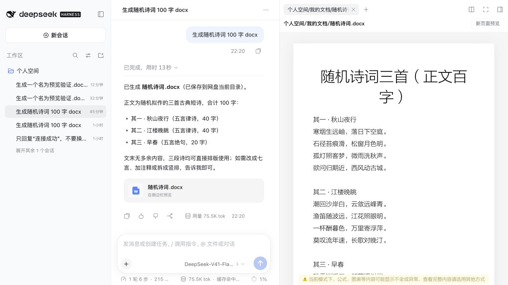

# 使用可道云问答

适用：本插件与 DSH `devtools-min-0.2.0-rc.2`。最后核对：2026-10-02。

## 生成文档并保存到网盘

1. 在可道云文件管理中进入想保存结果的目录。
2. 需要参考已有文件时选中文件，右键打开“问答”；直接打开问答则使用当前目录。
3. 查看输入框上方的“保存到”，确认目录正确。
4. 输入具体要求，例如“根据选中的资料生成项目周报，保存为 Word”。
5. 回答下方出现文件卡片后，点击卡片在右侧预览；也可返回网盘打开该文件。

图示只说明“回答 → 文件卡片 → 右侧预览”。截图采集于 2026-10-01，使用测试诗词文档；后续增加的“保存到”提示以当前界面为准。

## 在企业网盘中提问

在新对话的空间选择器中选择“企业网盘”，确认“保存到”显示企业网盘后再发送问题。空间列表取决于当前账号的可道云权限。
空间选择器新建的对话默认保存到该空间根目录；要保存到某个子目录，先在网盘中进入该目录再打开问答。
新对话会签发新凭证。旧对话的凭证可能到期，详见[凭证问题](troubleshooting.md)。

## 询问可道云怎么操作

选择“帮助文档”能力，再问一个具体问题，例如“怎样分享文件并设置有效期”。帮助模式只查手册，不替你修改网盘。
回答应给出简短步骤和“查看原文”链接。遇到界面名称不一致时，核对当前网盘版本；手册没有的信息会明确说明。
原文链接打开本项目维护的手册快照，需要能够访问 GitHub；并非当前网盘的操作按钮。

## 预览失败或找不到文件

预览页会保留错误说明，并提供“重试预览”。先确认网盘仍已登录，再检查文件是否被移动或删除。
操作失败时不要连续重复生成，先到“保存到”所指目录检查文件是否已存在。[更多故障处理](troubleshooting.md)

## 网盘设置与确认

需要修改、移动或删除等操作时，按界面提示逐条确认。确认前核对目标文件和目录；没有可道云权限的操作不会执行。
