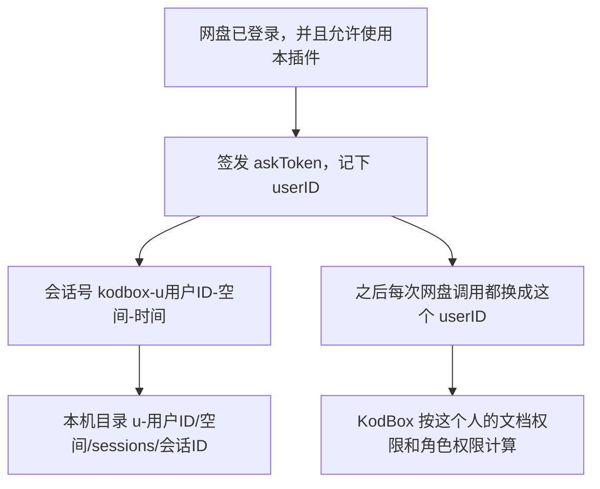
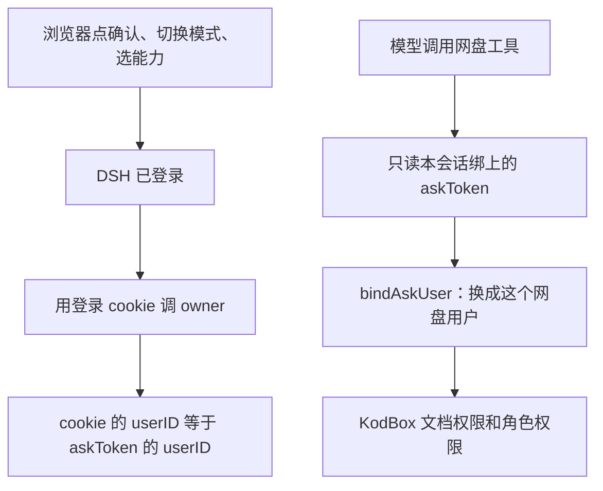

# 认证与架构

最后核对：2026-10-02。接口字段见 [开发接口](development/api.md)，部署路径见 [部署说明](deployment.md)。

这篇说明按调用顺序写清三件事：用户空间怎么隔开，认证体系里每张凭证管什么，能力、帮助和网盘设置怎么挂到同一次会话上。

网盘里谁能看、能改，由 KodBox 按当前用户计算。本机缓存里每个问答会话只碰自己的目录。网盘会话只开放受控文件工具和网盘接口，禁止通用终端、宿主机设置和未绑定的新会话。这里提供应用层隔离；如需开放任意代码执行，应按用户使用独立进程和操作系统权限。

## 用户空间隔离

### 身份怎么串起来

打开问答时，KodBox 已经登录。插件再查这个人能不能用本插件。通过后发出一张只属于他的 askToken，有效期 4 小时，文件权限 `0600`，放在 `data/temp/dshAsk/`。记录里写着 `userID`、唯一的 `spaceId/spacePath`、当前目录和引用文件。跨空间的混合引用会被拒绝，每次新建对话都会另发凭证，待确认队列和产物表不复用。

DSH 拿到这张凭证后，会话号写成 `kodbox-u<用户ID>-<空间>-<随机串>-<时间戳>`。工作目录跟着这个号走。下例为宿主机默认路径；当前 Compose 通过 DSH_KODBOX_HOME 使用 /dsh-workspaces，目录结构相同：

```text
/tmp/dsh-kodbox/u-<用户ID>/<空间ID>-<根目录ID>/sessions/<会话ID>/
```

个人空间和企业网盘按稳定 ID 分组、侧边栏各是一栏，每个会话再使用独立子目录。同一空间里之后打开的对话都挂在这一栏下，会话号仍然各自不同。目录权限 `0700`。会话号里的用户 ID 和目录前缀必须是同一个人。交接记录里的工作区路径也必须落在 `u-<用户ID>/` 下面。对不上就当这次会话不存在。`/tmp` 在 macOS 上指向 `/private/tmp`，比较的是解析后的真实路径。



### 浏览器和工具各验一次

浏览器上的确认、取消、切换模式、列待确认，都要同时满足两件事：KodBox 登录 cookie 还在，而且 cookie 里的用户 ID 等于这张 askToken 上的 `userID`。别人登录着自己的网盘，拿不到你的待确认操作。

模型调用工具时不看浏览器 cookie，也不接受模型在参数里另传一张 token。工具只能用创建这个会话时绑上的那一张。没有绑定，或已经过期，就停止，不会去翻别的会话，也不会换成另一个用户的凭证。

对外返回的上下文会去掉访问凭证、待确认队列和产物归属。模型看得到当前目录和引用文件，看不到这些内部记录。

原生 `/api/` HTTP RPC 和 `/api/remote.mux` WebSocket 同样经过服务端授权。账号从 KodBox 登录 cookie 验证取得，不信任客户端提交的用户 ID。侧栏、搜索结果、队列及事件只返回当前账号仍有空间授权的会话。新请求重新验证登录；长连接每次开启流重新验证，另每 15 秒检查登录和空间权限变化。

网盘文件接口按 source 祖先链验证是否属于绑定空间，再执行原生 ACL 检查。仅凭分享 ID、收藏 ID 操作的原始接口不在设置模式允许列表，避免绕过空间路径检查。回收站关闭时，专用删除工具和设置模式的删除均拒绝执行。

### 网盘调用变成这个人

DSH 请求本身没有网盘登录态。每次读目录、下载、上传、改权限之前，插件用 askToken 上的 `userID` 取出这个用户，确认账号仍启用、仍允许使用本插件，然后把本次请求的网盘身份设成他。个人空间根目录也按他的资料设置。管理员身份按角色上的 `administrator` 设置，并且发生在插件使用权限检查之前。插件权限没通过时，不替换当前浏览器会话。

因此后面的列目录、读写、分享、权限，走的都是 KodBox 原有规则：

- 文档能不能看、能不能改，看这份文件上的权限，以及部门继承。
- 网盘设置里的管理接口，再查他的角色有没有对应的 `allowAction`。管理员按 KodBox 自己的规则跳过这一层角色检查。
- 角色权限在 php-fpm 进程里有缓存。检查前只清掉当前这个角色的那一条，避免刚被收回的权限还留在缓存里。写入在排队时查一次，点确认执行时再查一次。中途被收回就留在队列里，不执行。

他看不见的部门、文件，工具也列不出来。他没有写权限的目录，新文件保存不进去。

### 本机缓存只留在这个会话里

工作区路径先做词法检查，再解析真实路径。下面这些都会被拒绝：

- `../` 跳出工作区
- 指向工作区外的符号链接
- 把还没写出来的文件挂在一个失效链接上
- 直接把工作区根目录本身当成一个文件来写

引用文件和本会话新生成的文件都记在这张交接记录上。引用文件的缓存可以改名让开，避免新建同名文件时把原件缓存搬走。新文件上传成功后，网盘上的 `{source:N}/` 记在这张 askToken 的产物表里。以后只有这张凭证可以替换它，而且当时仍要有写权限。引用进来的原件不在这张表里，不能被替换。产物归属如果写不进凭证，刚创建的网盘文件会删掉，避免留下一个谁的会话都不能认领的文件。

同一用户在同一空间里的多次问答仅共用侧栏分组。每次从该栏新建时，服务端验证当前浏览器账号仍拥有这个空间，再签发新凭证并建立独立目录。同一文件的修改和上传串行执行，Office 临时文件使用独占创建的随机名称。缺少完整绑定的旧会话不自动迁移，请从网盘重新打开；旧文件不会被删除。

### 各层挡住什么

| 层 | 检查 | 挡住的事 |
|---|---|---|
| 打开问答 | 已登录，且允许使用插件 | 未登录或被禁止的人拿不到凭证 |
| 浏览器操作 | cookie 用户等于 token 用户 | 别人确认、取消或切换你的队列 |
| 工具调用 | 只用本会话绑定的 token | 模型换一张别人的凭证，或跨会话试探 |
| 网盘身份 | 按 token 上的用户执行 | 以另一个人的身份列目录、改文件 |
| 角色权限 | 排队和确认各查一次 | 设置接口超出他的角色，或确认前权限已被收回 |
| 本机路径 | 真实路径必须在本会话目录内 | 读、写别的用户或别的会话的缓存 |
| 产物表 | 只记录在创建它的 token 上 | 替换别人的文件，或覆盖引用来的原件 |

## 认证体系

问答同时用到三套凭证。它们的签发方、存放位置和能做的事都不一样。

| 凭证 | 谁签发 | 放在哪 | 用来做什么 |
|---|---|---|---|
| KodBox 登录 cookie | KodBox 登录 | 浏览器 | 证明现在操作网页的人是谁 |
| DSH 启动 token | DSH 进程启动时写入 | `data/dsh-launch-token`，权限 `0600` | 只把还没有 DSH cookie 的浏览器送进 `/dsh/` |
| askToken | 打开问答时由插件签发 | `data/temp/dshAsk/`，权限 `0600` | 把这一次问答绑到一个网盘用户 |

模型密钥只放在 DSH 自己的配置里。它不进本仓库、不进共享 profile、不进交接记录，也不出现在回答里。

### 打开问答

右键「问答」、左侧入口和 `/dsh/` 未登录时的回跳，都先做同一组检查：KodBox 已登录，账号未禁用，并且插件配置里的使用范围允许这个人。使用范围是 KodBox 插件的 `pluginAuth`，由 `checkAuthValue` 判断。

通过之后才会签发 askToken。签发时同时做一张 KodBox 的 accessToken，算法与网盘官方一致，只写在 askToken 文件里，供本会话访问网盘文件接口。上下文接口返回给模型和浏览器之前，会去掉 accessToken、过期时间、待确认队列和产物表。

`pluginAuthOpen` 为 1，因此持有 askToken 的服务端请求可以拉取上下文，不必再带浏览器 cookie。token 形如 `ask_` 加 32 位十六进制，猜不到，过期后文件删除。过期或对不上用户时，从网盘重新打开。

DSH 启动 token 只出现在 `enter` 这一跳：浏览器打开 `/dsh/` 却还没有 DSH cookie 时，Nginx 把 401 转成进入 `enter`，`enter` 再把已登录的浏览器送到 `/dsh/?token=…`。这张 token 不进入问答上下文。DSH 的登录 cookie 是 `SameSite=Strict`，所以从网盘跳进问答时，先在 DSH 自己的地址上打开一页，再由该页继续，避免跨站跳转把 cookie 丢掉。

### 一次请求怎么认人



浏览器路径上的 `/kodbox/confirm`、`/kodbox/cancel`、`/kodbox/mode`、`/kodbox/skill`、`/kodbox/pending` 先要求 DSH 登录，再拿 KodBox cookie 去对 askToken 的主人。对不上就拒绝，并且不会把浏览器会话改成 token 上的另一个用户。

工具路径上没有浏览器 cookie。`bindAskUser` 只根据本会话的 askToken 恢复网盘用户，然后检查插件使用权限。恢复失败时不改写当前会话。

网盘设置接口在此之后还有一层：路由必须在允许列表里，角色的 `allowAction` 在排队和确认时各查一次。登录、改密码、上传、下载不在这张列表里。`confirm`、`shiftDelete`、accessToken 会被从参数里丢掉，回收不能变成彻底删除。回收站关闭时，删除直接拒绝。

待确认的写入要等浏览器主人点输入框上方的「确认执行」。一条确认只提交一个 id。模型不能在参数里自带确认。对话里单独回复「确认」时，如果待确认只有一条，由页面替用户提交这一条，模型不能口头宣布已经执行。

## 能力实现方式

能力不是另一套登录，也不是另一个网盘用户。它是贴在当前会话上的一段写作要求。会话仍然用原来的 askToken、原来的用户和原来的工作区。

### 清单从哪来

每项能力是 `agents/<id>.json`。插件启动时读仓库里的 `agents/`，也读数据目录 `data/dshAsk/agents/` 里的同名覆盖。`disabledAgents` 里列出的 id 不会出现。清单字段要满足：

| 字段 | 作用 |
|---|---|
| `id` | 小写字母开头，供 `/office`、`/skill` 和接口使用 |
| `name` / `description` | 菜单上看到的名字和一句说明 |
| `category` | `word`、`excel`、`powerpoint` 进 `/office`；`general` 进 `/skill` |
| `extensions` | 引用文件的后缀必须落在这里；文件夹不能作为引用 |
| `allowEmpty` | 没有引用文件时是否还能选用 |
| `outputs` | 允许的输出格式 |
| `requires` | 需要的执行器名称，例如 `office-docx` |
| `instructions` | 写作要求。目录接口不把这段返回给浏览器 |

`requires` 和本机环境变量 `DSH_OFFICE_CAPABILITIES` 对比。缺哪一项，菜单里标出来；真正选用时如果仍缺少，接口拒绝，不假装已经生成文件。

### 选中之后发生什么

`/office` 和 `/skill` 是选择菜单，因为下面有多项。点中一项后，浏览器把能力 id 交给 `/kodbox/skill`。服务端读对应的 json，确认有写作要求，再把「本次能力「名字」。加上写作要求」写进这张交接记录，最长 8000 字。写成功之后，输入框才放上 `【能力名】`。失败时输入框不变，输入框上方出现红色说明。

写作要求不留在输入框里。下一轮模型看到的系统提示由四段接成：基准规则、当前目录、当前模式、这次选中的能力。能力只影响怎么写，不更换用户，也不放宽网盘权限。

`/help` 和 `/disk` 下面没有子项，点开就切换，不再弹出只有一项的菜单。

### 三种模式

模式写在 askToken 上，也写在交接记录上。切换模式不清除尚未确认的队列。

| 模式 | 怎么进入 | 模型可以做什么 |
|---|---|---|
| 问答 `ask` | 打开问答时的默认值 | 读引用、写文件、走复制移动等网盘操作。不能调管理接口，不能检索手册 |
| 帮助 `help` | `/help`，输入框标记 `【帮助文档】` | 只用 `kodbox_help` 检索 `docs/kod/admin` 和 `docs/kod/user`。检索按标题和正文打分，空问题只返回章节标题。手册里没有就说明没有。这个模式拒绝新的网盘写入 |
| 网盘设置 `settings` | `/disk`，输入框标记 `【网盘设置】` | 只用 `kodbox_api`。参数不清楚时先要 `catalog`，内容来自 `docs/kod/api.md`。读取立即返回。写入排队，确认条文用用户名、部门名、角色名和权限名，不写 userID 这类编号。这个模式拒绝把文件下载到工作区再上传 |

帮助检索不读未提交的 `notes/`。运行时手册路径是仓库里的 `docs/kod/`。

### 文件能力怎么落地

选中的写作要求和模式只约束模型。文件真正落盘靠工具，而且都还在同一个会话边界里：

- 纯文本和 Markdown 用 `write`，写成 `.txt` 或 `.md`。
- docx、xlsx、pptx 用对应的 `word_*`、`excel_*`、`ppt_*`。普通 `read` 遇到这些后缀会转给对应的读取工具。
- 新建文件可以让开同名的引用缓存。修改已经引用的 Office 文件时不搬走原件。
- 工具成功之后，插件把工作区里的结果上传到网盘当前目录。同名则另存，不覆盖原件。本会话刚生成的文件才能按产物表替换自己。
- 复制、移动、重命名、建目录、回收，以及设置模式里的写入，直接调网盘接口并逐条排队，不把整个目录下载上来再传回去。

预览只在文件已经保存到网盘之后打开。标题用目录里的网盘显示名，不用本机工作区路径。
