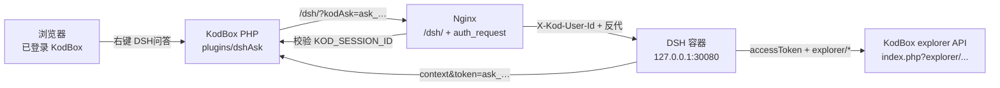

# KodBox × DeepSeek Harness（DSH 问答）

把 KodBox 个人空间 / 企业网盘接到 DeepSeek Harness：用户在网盘里右键打开问答，智能体通过 **KodBox 官方 explorer API** 列目录、读写、整理文件。

对外地址：`https://192.168.1.202/dsh/`  
KodBox 文档：<https://doc.kodcloud.com/v2/#/explorer/file>

## 1.1.0：Office Agent 能力广场

本仓库实现 **KodBox 插件端**的能力发现、选择、参数校验与任务交接。实际 Office 文件处理在外部 DSH 执行端完成；仓库不包含 DSH 服务、Office 文档库、二进制下载/上传工具或在线运行环境。新增的能力清单是任务规范，不是独立的 Office 执行引擎。

### 使用入口

- 左侧菜单和轻应用新增「Agent 能力广场」，原有 DSH 问答保持可用。
- 网盘选中文件后右键进入广场，携带所选文件与当前目录；选择单个目录时以其作为输出目录，不递归处理目录内容。
- 按 Word、Excel、PPT、综合分类或关键词搜索，格式不兼容的能力不可选。
- 填写处理要求、选择风格与输出格式，点击「准备任务」，然后「打开 DSH」。没有输入文件时仅支持可新建的能力，且必须填写要求。
- 完成任务准备不代表已执行。旧 DSH 未接入任务适配器时，可复制页面中的指令到 DSH 会话，文件绑定仍沿用原有 askToken 链路。

| 能力 ID | 功能 | 输入 | 输出 |
|---|---|---|---|
| `word-polish` | Word 排版美化 | docx | docx / pdf |
| `word-rewrite` | 润色校对 | docx / txt / md | docx |
| `word-report` | 报告与会议纪要，可新建 | docx / txt / md | docx / pdf |
| `excel-clean` | 数据清洗 | xlsx / csv / tsv | xlsx |
| `excel-analysis` | 分析与图表 | xlsx / csv / tsv | xlsx |
| `excel-style` | 表格美化 | xlsx / csv / tsv | xlsx |
| `ppt-beautify` | PPT 视觉优化 | pptx | pptx / pdf |
| `ppt-create` | 材料转演示，可新建 | docx / txt / md | pptx / pdf |
| `office-summary` | 多文件摘要与行动项 | docx / xlsx / pptx / txt / md / csv / tsv | docx / md |

不直接支持旧版 doc/xls/ppt 或加密文档。执行端需先转换或提示用户提供可处理的文件。

### 安装团队扩展

1. 复制 `examples/team-weekly-report.json`，按下面字段修改。
2. 由管理员部署到 **KodBox 的 DATA_PATH 下** `dshAsk/agents/`，例如 `/var/www/html/kodbox/data/dshAsk/agents/team-weekly-report.json`。这是持久化数据目录，不在插件更新覆盖范围内。
3. 刷新广场；无需修改 PHP 或前端代码。
4. 停用时在插件设置「禁用能力」中填写逗号分隔的 ID；也可以移走自定义清单文件。

| 字段 | 约束 |
|---|---|
| `schemaVersion` | 整数 `1` |
| `id` | 3–64 位，小写字母开头，只含小写字母、数字、连字符；必须唯一 |
| `name`, `description`, `version` | 非空字符串，每项最多 1000 字节 |
| `category` | `word` / `excel` / `powerpoint` / `general` |
| `extensions` | 支持的输入扩展名数组，不带点、小写字母与数字 |
| `outputs` | 非空输出扩展名数组，同上 |
| `tags` | 搜索标签数组 |
| `allowEmpty` | 布尔值，是否允许不选文件直接创建 |
| `instructions` | 非空执行规范，最多 16000 字节 |
| `requires` | 执行端需要提供的能力标识数组 |

每个数组最多 30 项，每项最多 100 字节；每个清单最多 64 KiB。只读取该目录直属 `.json` 文件，不加载符号链接、PHP 或远程脚本。内置 ID 优先，重复 ID 与非法清单跳过，其他能力仍可使用。广场显示跳过数量；管理员可使用 `DshAskAgentRegistry::errors()` 查看校验原因。扩展目录只应允许管理员写入。禁用设置会同时影响列表与新任务提交；已签发的会话保留当时的能力快照。

### DSH 执行端接入（部署必需）

新增 API，沿用 KodBox `show_json` 的 `{code, data}` 返回格式：

- `GET index.php?plugin/dshAsk/plaza`：登录后的能力广场。
- `GET index.php?plugin/dshAsk/agents`：登录后的有效能力列表。
- `POST index.php?plugin/dshAsk/openAgent`：参数 `agentId`、`files`（JSON 数组）、`currentPath`、`request`、`outputFormat`、`style`；返回 `{token, link, prompt}`。支持最多 100 个选中文件；`files` JSON 字符串上限 256 KiB，要求上限 12000 字节。
- 原有 `context` 返回值新增可选 `agentTask`；普通 `openAsk` 没有此字段。

`agentTask` 包含版本化能力快照、用户要求、输出格式、视觉风格、输出策略和完整指令。`style` 支持 `professional`、`minimal`、`vibrant`、`preserve`。示例适配器位于 `integrations/dsh-agent-task.cjs`：

```js
const { prepareAgentTask } = require('./dsh-agent-task.cjs');
// context：现有 kodbox-file 服务从可信 KodBox 地址拉取的 context.data。
// authenticatedUserId：经 Nginx 登录门禁验证的当前用户，不能使用客户端自报 ID。
// availableCapabilities：执行环境实际已安装且可调用的能力，不能直接照抄清单。
const task = prepareAgentTask(context, authenticatedUserId, availableCapabilities);
// task === null 表示普通问答。
// 将 task 绑定到本次新建的 DSH 会话，把 task.prompt 作为待发送的用户任务；
// 经用户启动后交给现有执行器。具体注册/发消息方法使用部署版本的 DSH API。
```

此适配器是接入函数，**不会自动注册 DSH 插件或自动执行任务**。需要在外部 `kodbox-file` 绑定流程中调用，并确保：

1. `context.userID` 与门禁用户一致；任务保存到本次会话，不能使用同一用户共享的可覆盖全局任务，避免两个标签页串任务。
2. 执行环境提供所需 `office-docx`（Word 读写）、`office-xlsx`（表格读写）、`office-pptx`（幻灯片读写）、`office-render`（渲染/PDF）、`office-recalculate`（公式重算）。这些是本协议的能力标识，不是 DSH 自带工具名称；应根据实际工具映射。
3. 用当前用户凭证通过 KodBox 官方接口下载/上传 Office 二进制，ACL 由 KodBox 校验。现有文本 `kodbox_read/write` 不能代替 Office 二进制处理。下载到隔离临时目录，处理完成后清理；不要将 accessToken 放入模型指令、日志或浏览器响应。
4. 执行器落实 `policy.writeMode = new-copy`、`preserveSource = true`，处理重名文件时生成新文件名，不覆盖原件。清单中的约束与 prompt 是任务要求，**不是文件权限隔离实现**；真正的写入限制需由执行器检查。
5. 对结果执行打开、渲染或公式重算检查，再返回真实文件链接、变更摘要与失败原因。缺少工具时明确报错，不能宣称已完成。

### 本地验证

```bash
php -l app.php
php -l lib/AgentRegistry.php
php tests/registry.php
php tests/api.php
node --check static/main.js
node tests/handoff.cjs
```

测试覆盖清单校验、冲突与禁用、格式适配、登录与 POST 检查、非法任务参数、任务持久化、原有问答兼容、DSH URL 查询参数/锚点保留、执行端用户隔离与能力缺失。`tests/api.php` 使用 KodBox 桩对象，不等同真实部署联调。发布前仍需在目标 KodBox/DSH 上验证菜单挂载、用户权限及真实 Office 生成/回传。

---

## 设计原则

1. **网盘不是 Linux 目录。** `{source:123}/` 是 KodBox 空间 ID，不是磁盘路径。`/workspace/kodbox/...` 只是 DSH 侧边栏用的空锚点，里面没有真实文件。
2. **身份用 KodBox，不用 DSH 自带登录。** DSH 默认单用户、无鉴权；本方案用 Nginx `auth_request` 校验 KodBox 会话。
3. **文件权限跟 KodBox ACL 走。** 智能体带着当前用户的 `accessToken` 调 explorer；能写企业网盘就能写，没有权限会失败。
4. **不改 `plugins/dsh`。** 那是 WorkPal / SSO / WebDAV 另一条链路。本方案是独立插件 `dshAsk` + DSH 插件 `kodbox-file`。

---

## 总架构



| 组件 | 位置 | 职责 |
|---|---|---|
| KodBox 插件 `dshAsk` | `/var/www/html/kodbox-enterprise-trixie/plugins/dshAsk/` | 右键菜单、签发 askToken、登录门禁、列出个人/企业/部门空间 |
| DSH 插件 `kodbox-office-tools` | `integrations/kodbox-file/` | 单个入口整合 KodBox 上下文/目录工具与 Word、Excel、PowerPoint 工具 |
| Nginx | `/etc/nginx/conf.d/dsh.sub` + `snippets/dsh-auth-proxy.conf` | `/dsh/` 反代、KodBox 登录校验、把用户 ID 传给 DSH |
| Compose | `/root/work2/compose.yml` | DSH 镜像、只绑本机 `127.0.0.1:30080`、环境变量 |

DSH 镜像：`alliot/deepseek-harness:dsh-0.1.0-rc.6`  
插件通过 `.dsh/profiles/web/cordis.patch.yml` 插入：

```yaml
- insert:
    - id: kodbox-office-tools
      name: ./plugins/kodbox-file/index.js
```

---

## 打开问答的完整链路

```
1. 用户已登录 KodBox，在个人空间或企业网盘右键「DSH问答」
2. 前端 POST /?plugin/dshAsk/openAsk
     files=[{path,name,type,pathDisplay,sourceID,targetType}]
     currentPath={source:…}/
3. dshAsk 校验登录，签发：
     - askToken   ask_ + 32 hex，TTL 4 小时
     - accessToken  用当前 PHP session sign 按官方算法 Mcrypt::encode
     - workspaces   个人空间 + 企业网盘 + 部门
   写入 data/temp/dshAsk/ask_….json（不放 plugins/ 下，避免被静态访问）
4. 浏览器打开 /dsh/?kodAsk=ask_…
5. Nginx auth_request → plugin/dshAsk/loginGate
     未登录：页面 302 到 KodBox 登录；API 401 JSON
     已登录：200，响应头 X-Kod-Userid=<userID>
   Nginx 覆盖写入上游：X-Kod-User-Id / X-Kod-Userid
6. DSH 页面脚本 POST /dsh/kodbox-ask/bind { token }
7. kodbox-file 用 askToken 拉 context（DSH 容器 → host.docker.internal）
   校验 context.userID 与请求头用户一致
   按用户写入 bind，注册侧边栏工作区
8. 用户发消息；智能体调用 kodbox_list 等工具
   工具用该用户的 accessToken POST explorer API
```

右键脚本：`plugins/dshAsk/static/main.js`  
- 选中文件：带上选中对象  
- 空白处：带上当前目录（「DSH问答（当前目录）」）  
- 左侧菜单 / 轻应用：走 `dshAsk/index`，无选中文件时用当前路径

---

## 路径模型

KodBox 每个目录/文件都有 `sourceID`。API 路径形如：

| 含义 | 路径 |
|---|---|
| 某用户的个人空间根 | `{source:5}/` |
| 企业网盘根（集团 group 1） | `{source:1}/` |
| 个人空间下的文件夹 test002 | `{source:341707}/` |
| 回收站 | `{userRecycle}` |
| 子文件（也可写成） | `{source:341707}/目录说明.txt` |

DSH 侧边栏需要真实存在的本地目录才能 `workspaceRegistry.create()`，因此为每个用户建空锚点：

```
/workspace/kodbox/u<userID>/
  个人空间/          →  {source:<home>}/
  企业网盘/          →  {source:<company>}/
  部门/<部门名>/     →  该部门 {source:…}/
  _ask/<右键目录>/   →  右键选中的文件夹（若不是某个空间根）
```

这些目录是空的。`ls` / `find` / `cat` 看不到网盘内容。智能体必须用 `kodbox_*` 工具。

映射存在两处：

- 内存 `localMap`：本地绝对路径 → `{ kodPath, type, name, userID }`
- 持久化 `/root/work2/.dsh/kodbox-ask.json`（容器内 `/home/node/.dsh/kodbox-ask.json`）

`toKodPath()`：若参数已是 `{source:…}` 则原样使用；若是 `/workspace/kodbox/u1/企业网盘` 则换成 `{source:1}/`。

---

## 身份与隔离

### 1. 入口登录（谁能打开 /dsh/）

DSH 进程本身没有用户体系。Nginx 对 `/dsh/`、`/api/session.*`、`/api/workspace.*`、WebSocket、相关 plugins 做 `auth_request`：

```
location = /internal/dsh-auth    →  plugin/dshAsk/loginGate   （internal）
location @dsh_need_login         →  plugin/dshAsk/needLogin
```

`loginGate` 方法名不能叫 `authCheck`（与 `PluginBase::authCheck` 冲突）。

DSH 端口只绑本机，避免绕过 Nginx：

```yaml
ports:
  - "127.0.0.1:30080:3080"
```

### 2. API 身份（智能体以谁的名义操作网盘）

每个 KodBox `userID` 一份 bind（`accessToken`、选中文件、workspaces）。  
后打开问答的人**不会**覆盖前人的 token。

请求进入 DSH 时，插件给 `http.Server.prototype.emit` 打补丁，把 `X-Kod-User-Id` 放进 `AsyncLocalStorage`。  
`kodbox_*` 工具执行前再按 DSH session 的 cwd（`/workspace/kodbox/u1/...`）或 `sessionUsers` 映射确定用户。

`requireBind()` 只返回**当前用户**的 bind。`kodboxPost()` 始终带这个用户的 `accessToken`。

### 3. 侧边栏 / 会话列表

`workspaceRegistry.list()` / `sessions.list()` 被包装：

- 丢掉旧的未分用户锚点（`/workspace/kodbox/个人空间` 这种）
- 不展示用户根 `KodBox · 1`
- 有用户头时只显示 `/workspace/kodbox/u<id>/` 下的空间
- 同名空间只留一份

启动时 `pruneDuplicateWorkspaces()` 会从注册表删除遗留重复项。

### 仍共用的部分

同一 DSH 进程、同一 `$DSH_HOME`：模型密钥、系统设置仍共用。聊天记录按工作区路径过滤。若要物理隔离，需要每用户单独 DSH 家目录或容器。

---

## DSH 工具与 KodBox API 对应

所有写回模型的 JSON 都经 `jsonSafe()`（`JSON.parse(JSON.stringify)`），避免 DSH 无损 JSON 拒绝 `undefined`。  
`kodbox_list` / `kodbox_search` / `kodbox_recycle_list` 只返回精简字段：`name, path, type, size, modifyTime, pathDisplay`。

| 工具 | KodBox 接口 | 说明 |
|---|---|---|
| `kodbox_context` | （本地 bind） | 右键选中的对象、当前目录、可见空间 |
| `kodbox_workspaces` | （本地 bind） | 个人空间 / 企业网盘 / 部门 |
| `kodbox_list` | `explorer/list/path` | 列目录 |
| `kodbox_info` | `explorer/index/pathInfo` | 属性 |
| `kodbox_read` | `explorer/editor/fileGet` | 读文本 |
| `kodbox_write` | `explorer/editor/fileSave` | 写文本（保留版本） |
| `kodbox_mkdir` | `explorer/index/mkdir` | 建文件夹 |
| `kodbox_mkfile` | `explorer/index/mkfile` | 建空文件 |
| `kodbox_rename` | `explorer/index/pathRename` | 重命名 |
| `kodbox_copy` | `explorer/index/pathCopyTo` | 复制 |
| `kodbox_move` | `explorer/index/pathCuteTo` | 移动 |
| `kodbox_delete` | `explorer/index/pathDelete` | 默认进回收站 |
| `kodbox_search` | `explorer/list/path` + `{search}/…` | 搜索 |
| `kodbox_recycle_list` | `explorer/list/path` `{userRecycle}` | 回收站 |
| `kodbox_recycle_restore` | `explorer/index/recycleRestore` | 还原 |

官方 `pathDelete` / `pathCopyTo` / `pathCuteTo` **只认 `dataArr[].path` 完整路径，会忽略单独的 `name`。**  
插件会把「父目录 + 文件名」解析成子路径：先 `list/path` 找同名条目；找不到再拼接。  
禁止删除当前用户的空间根和右键会话根目录。

`fs` / 目录选择器在锚点下会转到上述 API。  
`tools/pre-execute`：仅当命令真正碰到 `/workspace/kodbox`（或 cwd 在锚点下的相对 `ls`/`cat`/`rm`）时拦截 bash/grep；普通 Linux 路径可用。

DSH 容器访问 KodBox：

```
KODBOX_API_BASE=http://host.docker.internal
```

`extra_hosts: host.docker.internal:host-gateway`。

---

## 企业网盘如何出现在侧边栏

不是 rclone/WebDAV 挂载。

`dshAsk::listWorkspaces()`：

1. `MY_HOME` → 个人空间  
2. `$user['groupInfo']` 里每个部门；`groupID==1` 命名为企业网盘  
3. `Source::sourceRootGroup()` 得到该组织的 `{source:ID}/`

用户从网盘右键打开问答后，`kodbox-file` 为每个 space 建锚点并 `workspaceRegistry.create()`。  
智能体列企业网盘：`kodbox_list path={source:1}/`（ID 以实际 bind 为准）。

账号必须属于对应组织，否则 `groupInfo` 为空，侧边栏不会出现企业网盘。

---

## 关键文件

```
/root/work2/
  compose.yml
  README.md                          ← 本文件
  .dsh/
    kodbox-ask.json                  ← 按用户 bind + 路径映射
    profiles/web/
      cordis.patch.yml
      plugins/kodbox-file/index.js

/var/www/html/kodbox-enterprise-trixie/plugins/dshAsk/
  app.php                            ← openAsk / context / loginGate / needLogin
  package.json
  static/main.js                     ← 右键菜单
  i18n/

/var/www/html/kodbox-enterprise-trixie/data/temp/dshAsk/
  ask_<hex>.json                     ← 短期问答凭证（含 accessToken）

/etc/nginx/conf.d/dsh.sub
/etc/nginx/snippets/dsh-auth-proxy.conf
```

**不要修改** `plugins/dsh`。

---

## 运维

```bash
# 重启 DSH（加载整合后的 kodbox-office-tools）
docker compose -f /root/work2/compose.yml up -d

# 重载 Nginx（登录门禁）
nginx -t && systemctl reload nginx
```

环境变量（compose）：

| 变量 | 含义 |
|---|---|
| `KODBOX_API_BASE` | DSH 容器访问 KodBox 的根 URL |
| `DSH_KODBOX_HOME` | 锚点根目录，默认 `/workspace/kodbox` |
| `HOME` | DSH 家目录，bind 存在 `$HOME/.dsh/kodbox-ask.json` |

常见问题：

| 现象 | 原因 / 处理 |
|---|---|
| 打开 /dsh/ 跳登录 | 未登录 KodBox，属预期 |
| 请先登录 / token 无效 | 从网盘重新右键「DSH问答」；accessToken 绑的是 PHP session，session 过期需重开 |
| `value is not lossless JSON` | 工具返回含 `undefined`；现已 jsonSafe + 精简 list |
| bash 全被拦截 | 已改为只拦网盘锚点；刷新后再试 |
| 侧边栏重复 | 旧锚点与 `u<id>/` 并存；启动会 prune，刷新页面 |
| 工具删错整个目录 | 官方 API 忽略 name；现已解析子路径并保护空间根 |
| 直连 `:30080` | 已改为只听 127.0.0.1，须走 `https://主机/dsh/` |

---

## 安全要点

- askToken 存在 `data/temp/dshAsk/`，不放可 Web 访问的 `plugins/` 下。  
- `dshAsk/context` 因 `pluginAuthOpen` 可匿名访问，但 token 不可猜测且有 TTL。  
- `/dsh/` 必须带有效 KodBox cookie。  
- 浏览器自带的 `X-Kod-User-Id` 会被 Nginx 覆盖，不能冒充他人。  
- bind 时 context.userID 必须与门禁用户一致。  
- 删除默认进回收站；空间根不可删。
